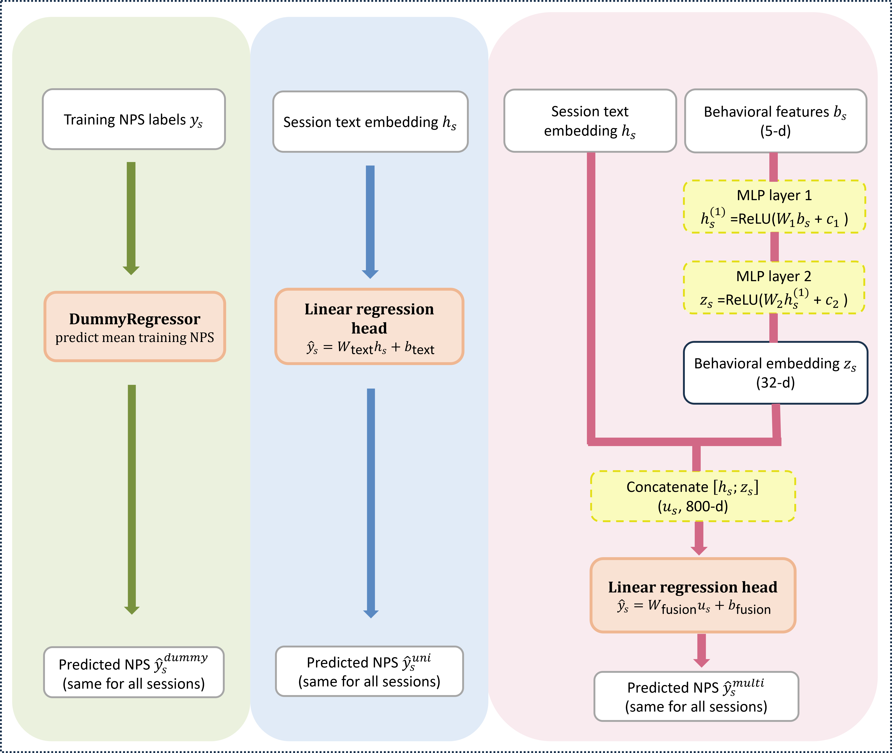

# Multimodal Chatbot NPS Prediction

Predicting customer satisfaction (NPS) from multilingual chatbot logs by combining XLM-RoBERTa text embeddings with engineered behavioural features in a late-fusion deep learning architecture.

Built during an internship at **LG Electronics Netherlands** and extended into an MSc thesis at Tilburg University (Jan 2026).

---

## Overview

Large-scale customer-service chatbots generate thousands of sessions daily, but most users never fill out a post-chat satisfaction survey. This project builds a model to predict session-level NPS (0–10) directly from interaction logs — surfacing dissatisfaction signals for non-responding users.

The core finding: **conversation text alone is nearly useless for NPS prediction in this setting.** Behavioural signals (engagement, escalation, platform) drive the improvement.

---

## Results

| Model | Test MAE |
|---|---|
| Dummy baseline (predict mean) | 3.727 |
| Text-only (XLM-RoBERTa) | 3.723 |
| **Multimodal (text + behaviour)** | **3.553** |

4.7% MAE reduction over baseline. Feature importance analysis (LOFO, permutation, SHAP) consistently ranks `engagement_score` as the dominant predictor, followed by `livechat_flag` and `platform_flag`. Activeness and interaction density contribute minimally.

The analysis surfaced two actionable dissatisfaction profiles: sessions with early escalation signals (route to agent immediately) and sessions with quietly dropping engagement (proactive mid-session intervention). These were pitched as a selective escalation strategy to the LG HQ chatbot team.

---

## Model Architecture



Late fusion combining a multilingual text encoder (XLM-RoBERTa, 768-d) with a 2-layer behavioural MLP (5→32-d), concatenated and fed into a linear regression head. Trained end-to-end with AdamW and MAE loss.

---

## Repo Structure

```
├── README.md
├── assets/
│   └── architecture.png
├── src/
│   ├── preprocess/
│   │   ├── 01_eda_and_cleaning.py
│   │   ├── 02_session_features.py
│   │   └── 03_chunking_xlmr.py
│   ├── modeling/
│   │   ├── dataset.py
│   │   ├── models.py
│   │   └── train.py
│   └── analysis/
│       ├── main_sub_rq1.py
│       ├── sub_rq2.py
│       └── sub_rq3.py
```

---

## Tech Stack

Python 3.12 · PyTorch · HuggingFace Transformers (`xlm-roberta-base`) · SHAP · scikit-learn · pandas · NumPy · Matplotlib · Seaborn · NLTK

---

## Note on Data

Chatbot logs are proprietary to LG Electronics and are not included. Code is provided for reference.
